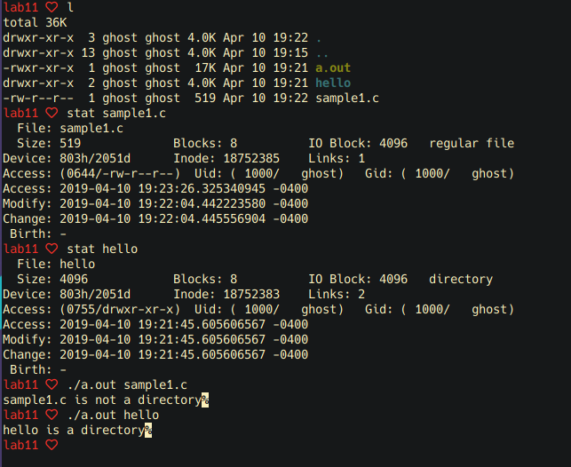

# Lab 11

Jarred Parr and Alexander Fountain

1. a. `stat(1)` is a command line program and `stat(3)` is a library function which invokes that same functionality but inside of a running executable.

   b. This program reads a from `stdin` the name of a file and then uses `stat` to report the mode and type of file that it is.

   c.

   ```C
   #include <stdio.h>
   #include <stdlib.h>
   #include <sys/stat.h>
   #include <sys/types.h>
   #include <errno.h>

   int main(int argc, char *argv[])
   {
      struct stat statBuf;

      if (argc < 2) {
         printf ("Usage: filename required\n");
         exit(1);
      }

      if (stat (argv[1], &statBuf) < 0) {
         perror ("huh?  there is ");
         exit(1);
      }

      if ((statBuf.st_mode & S_IFMT) == S_IFDIR) {
         printf("%s is a directory\n", argv[1]);
      } else {
         printf("%s is not a directory\n", argv[1]);
      }
      return 0;
   }
   ```

   

2. a. This program opens a pointer to the current directory (denoted by `"."` and performs a while loop and reads the filename of each value in the directory and prints out the values to the console.

3. a. Depth first search tree traversal. This is evident in the layout featuring the sizes of subfolders of the parent first, then the parent, which validates that it accesses the root node and its data before moving onward.

   b. As evidenced by the man page, the block size for `du` is `1024`.

   c. Reporting data size in terms of the block size allows the user to get an idea not only how many blocks the system is utilizing for its storage, but also can inform the user of this number as well in a succinct way.
